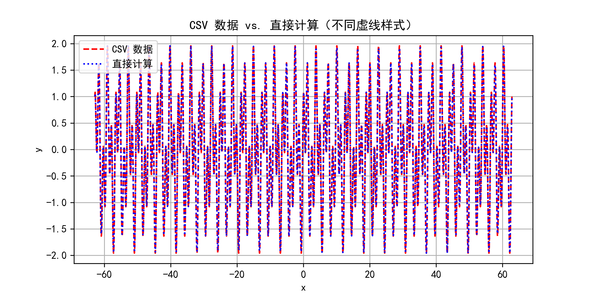
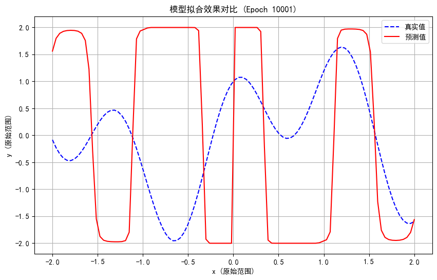
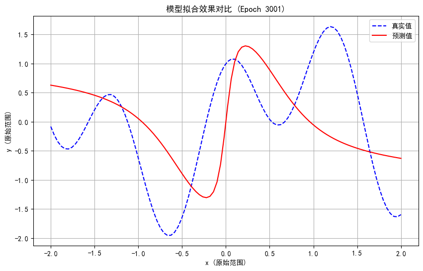
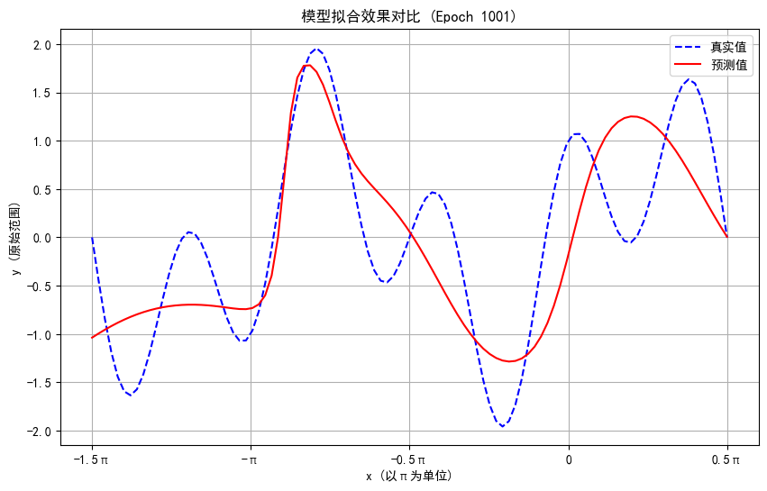
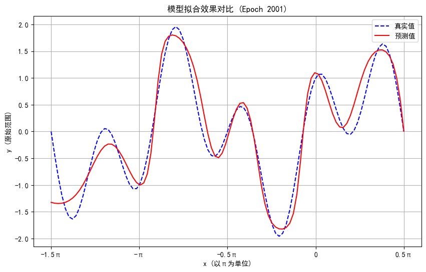
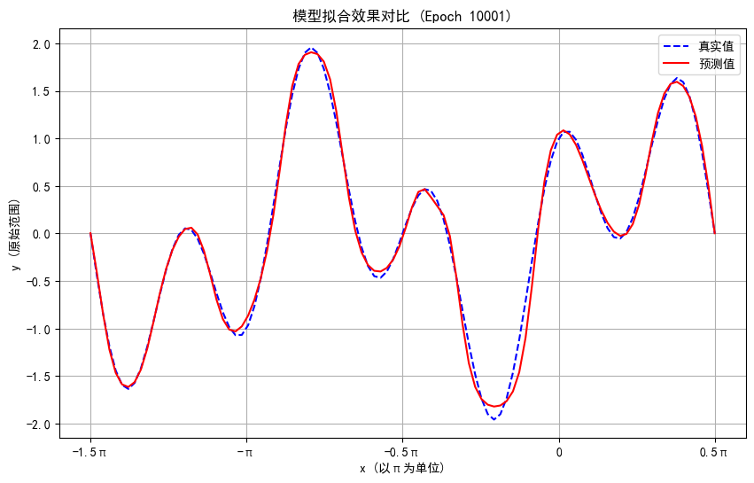
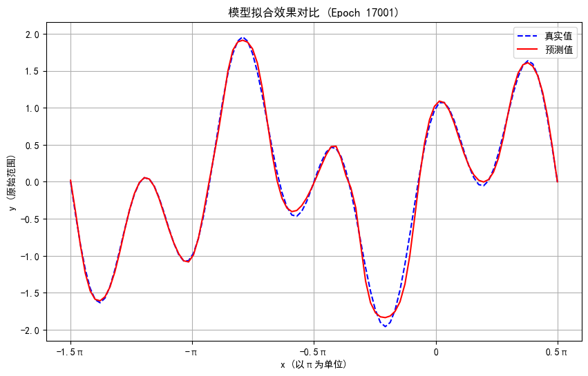

# 拟合函数
利用bp神经网络拟合三角函数sin(2x)+cos(5x)，并分析拟合效果
### 数据拟处理
首先，如果我们将所有数据（一个周期内的）都训练进去，是不是太没意思了，如果要真正拟合一个未知的函数，我们不一定知道其形状，值域。所以我们进行训练的数据将不仅仅局限于一个周期内的。
### 初始内容与训练集
基于数据拟处理的思想，我们不仅仅只选择一个周期内的值  

先试着拿到数据，得到sin(2x)+cos(5x)的函数图像
利用np库得到函数的精确值
```python
# 生成 1000 个 x 值，范围从 0 到 T
x_values = np.linspace(0, T, 1000)

# 计算对应的 y 值，并保留 4 位小数
y_values = np.round(np.sin(2 * x_values) + np.cos(5 * x_values), 4)
```
保存到csv文件中，当然，还需要对比得到的图像是否正确：
```python
plt.rcParams["font.sans-serif"] = ["SimHei"]  # 设置中文字体（黑体）
plt.rcParams["axes.unicode_minus"] = False  # 解决负号显示问题

# 读取 CSV 文件
df = pd.read_csv("sin_cos_training_data.csv")  # 请替换为你的文件路径
x_csv = df["x"]
y_csv = df["y"]

# 重新计算 y = sin(2x) + cos(5x)
x_calc = np.linspace(0, 2 * np.pi, 1000)
y_calc = np.sin(2 * x_calc) + np.cos(5 * x_calc)

# 绘制曲线（使用不同虚线样式）
plt.figure(figsize=(8, 4))
plt.plot(x_csv, y_csv, label="CSV 数据", color="red", linestyle="dashed")   # 红色短虚线 "--"
plt.plot(x_calc, y_calc, label="直接计算", color="blue", linestyle="dotted")  # 蓝色点状线 ":"

# 添加标签和标题
plt.xlabel("x")
plt.ylabel("y")
plt.title("CSV 数据 vs. 直接计算（不同虚线样式）")
plt.legend()
plt.grid(True)

# 保存图片
plt.savefig("comparison_plot.png", dpi=300)
plt.show()
```
执行结果如下：

这个对比代码后续可能还会进行重构，让它能通过出入的文件进行对比。这边先搁置，最后再来处理。当然，最后也不是拿出这里的数据进行测试，而是-20T~-10T,10T~20T的数据。  
当然，由于有限的测试集与训练集，验证集也使用测试集，我感觉问题不大。但实际上如果动态根据验证结果更改学习率，那选取不一样的验证集确实是有必要的。
### 网络结构前瞻
数据集是一千个输入对应了一千个输出，结合bp神经网络拟合手写数字的例子，我们第一步得思考这个神经网络的节点数量的安排。当然这边先用0.5学习率进行学习。  
数据很明确，一个输入一个输出，但如果仅仅如此，中间节点层数仅为一层的话我第一感觉效果会比较差。于是我考虑搭建一个两层隐藏节点的神经网络。  
这也许意味着整个网络运行效率会比较慢？之前是728*100*10次运算，这次我们也尽量将运算次数接近，如果是1*100*100,差了10倍，所以我想着再在后面插入10个节点，为第三层。  
当然上述只是猜想，如果效果出入太大再进行逻辑上的大改（结构的改变），如果效果较好就进行小改（学习率与节点数的调整）  
### 构建代码
----大体代码写完了，但有许多漏洞，生成的代码值总是为2（过大）,感觉问题出在反向传播上，下次再慢慢调
### 重构代码
---2/9-2/11
这几天经历了很多，从发现sigmoid无法存在负值的输出，到选择tanh作为激活函数。再到无法得到预期的训练导致的函数输出无效。投入比较多的时间进去。  
再重新梳理一遍逻辑吧。首先一个神经网络最重要的是结构，再者是激活函数。然后才是初始化啊...  

#### 结构
这次选择三层神经网络，即输入层，隐藏层1，隐藏层2，输出层。三层神经网络在理论上可以逼近任意函数，所以我也就不担心其无法拟合。当然层数越多越好，节点数也越多越好  
但之前我的梯度爆炸了，所以不敢使用过多的节点与层数。

#### 激活函数(tanh)
非常有特点的一个激活函数。中文叫双曲正切函数$$
\tanh(x) = \frac{e^x - e^{-x}}{e^x + e^{-x}}
$$
他的导数（梯度）也非常好算:$$1-tanh(x)^2$$
由于习惯不同，在一次失败中我求梯度的时候写成了$$[1-tanh(x)]^2$$
导致梯度直接爆炸，一两轮就输出了nan。
#### 初始化
我这边的初始化没怎么改，沿用了之前的He初始化，实际上推荐Xriver初始化，说是配套使用。总之能避免梯度消失与梯度爆炸的初始化就是好的初始化。
#### 偏置
实际上不需要偏置的。原因是我的打印图片有问题(扔给DeepSeek生成的以为没毛病，后来调试了几个小时才发现)，生成的图总是严格关于原点对称。  
还以为数学和计算机学不存在了，改为玄学了。
##### 原因
总之后来才发现读取x_test时将矩阵传成了值。不敢相信我对着将一整个矩阵传成值后再传
入成为矩阵的画出来的图像研究了多久T_T。当时的图像都是这样的：
研究了一天的输出结果：



展示一波逆天粗心代码：
```python 
def save_plot(weights, epoch, data):  # 新增绘图保存函数
    """绘制并保存拟合效果图"""
    os.makedirs('result', exist_ok=True)  # 确保目录存在
    
    x_test = data['x_test']
    y_test = data['y_test']
    
    # 生成预测结果
    y_pred_scaled = predict(x_test, weights)
    
    # 数据范围逆标准化
    x_test_original = x_test * 2
    y_test_original = y_test * 2
    y_pred_original = y_pred_scaled * 2
    
    # 创建新图表
    plt.figure(figsize=(10, 6))
    plt.plot(x_test_original, y_test_original, 
             label='真实值', linestyle='--', color='b')
    plt.plot(x_test_original, y_pred_original,
             label='预测值', linestyle='-', color='r')
    plt.title(f"模型拟合效果对比 (Epoch {epoch})")
    plt.xlabel("x (原始范围)")
    plt.ylabel("y (原始范围)")
    plt.legend()
    plt.grid(True)
    
    # 保存文件
    filename = f"result/epoch_{epoch:06d}.png"
    plt.savefig(filename, bbox_inches='tight')
    plt.close()  # 关闭图表释放内存

def predict(x, weights):
    # 前向传播计算预测值
    weights1 = weights['weights1']
    weights2 = weights['weights2']
    weights3 = weights['weights3']

    z1 = x @ weights1
    a1 = np.tanh(z1)
    z2 = a1 @ weights2
    a2 = np.tanh(z2)
    z3 = a2 @ weights3
    y_pred = np.tanh(z3)
    return y_pred
```
修改后的大致思路：
```python
y_pred = []
for i in range(len(x)):
    node0 = x[i].reshape(1, -1)  # 转为行向量 (1, input_size)
    # 前向传播（添加偏置）
    z1 = node0 @ weights1 + bias1  # 关键修改：+ bias1
    a1 = np.tanh(z1)
    z2 = a1 @ weights2 + bias2  # 关键修改：+ bias2
    a2 = np.tanh(z2)
    z3 = a2 @ weights3 + bias3  # 关键修改：+ bias3
    y_pred.append(np.tanh(z3))
```
返回这个y_pred列表，然后一输出结果，直接惊了。当然也是有点心理准备的，因为我在最终完成前，进行了一个调试：
```python
# 计算损失
loss += abs(result[0, 0] - y_train[i])
max_loss = max(abs(result[0, 0] - y_train[i]), max_loss)

print("平均误差：",loss / len(x_train))
print("最大误差", max_loss)
```
然后我就发现不对劲，这边的最大损失也就0.05左右(还没跑到几轮)，平均误差也和宣传不符合。于是检查画图函数，豁然开朗。
所以偏置的成因可想而知，为了解决关于原点对称，但即使加上了仍然严格对称。。。所以当时还改了数据集，专门选了一整个周期内的函数，说多了都是累T_T

### 成果展示
这边放上两张拟合图片和一些数据吧：  


  

大概两千轮就开始生效，大概花2分钟，也许吧。然后是一万轮以后的效果：  


  
当然结果开始摇摆了，说明学习率可能受到限制或者别的原因：
开始训练epoch 22033
平均误差： [0.00222711]
最大误差 [0.05505202]

开始训练epoch 22034
平均误差： [0.00208843]
最大误差 [0.03873772]

开始训练epoch 22035
平均误差： [0.00198441]
最大误差 [0.03971183]

开始训练epoch 22036
平均误差： [0.00222796]
最大误差 [0.05765052]

开始训练epoch 22037
平均误差： [0.00219471]
最大误差 [0.05005301]

所以后续如果需要很完美的拟合的话，可以考虑上点强度（层数+神经元个数），动态学习率的调整，加入噪点啥的。
